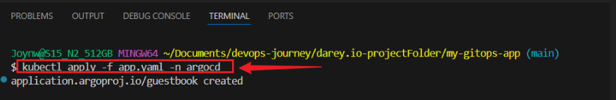
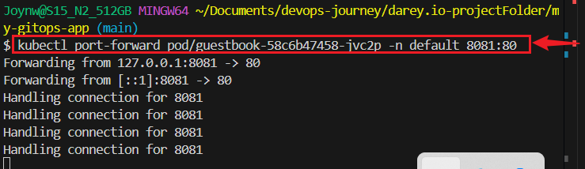

# GitOps with ArgoCD on AWS

> In this project, I implemented **GitOps** using **ArgoCD** in a **Kubernetes cluster on AWS (EKS)**. This project is designed to help understand modern DevOps practices using real-world tools.

---

## Project Objectives

- Understand GitOps principles and workflows.
- Install and configure ArgoCD in an AWS EKS cluster.
- Deploy and manage Kubernetes applications with ArgoCD.
- Learn to sync your infrastructure state with Git.


---


## Tools & Technologies Used


| Tool         | Purpose                            |
|--------------|------------------------------------|
| AWS          | Cloud provider (EKS for Kubernetes)|
| EKS (K8s)    | Managed Kubernetes Cluster         |
| ArgoCD       | GitOps tool for Kubernetes         |
| Git          | Version control for manifests      |
| kubectl      | Command-line tool for Kubernetes   |
| eksctl       | EKS cluster provisioning           |
| Docker       | (Optional) Container image building|


---

## Prerequisites

Ensure the following are installed and configured:

- [AWS CLI](https://docs.aws.amazon.com/cli/latest/userguide/install-cliv2.html)
- [kubectl](https://kubernetes.io/docs/tasks/tools/)
- [eksctl](https://eksctl.io/)
- [Git](https://git-scm.com/downloads)
- [Docker (optional)](https://docs.docker.com/get-docker/)
- An active [AWS account](https://aws.amazon.com)


---

## Project Structure

```bash
my-gitops-app
├── guestbook/                                
├── app.yaml                      
└── README.md                     
```


## Project Setup

### Step 1: Create a project folder
```bash
mkdir my-gitops-app
cd my-gitops-app
```

## Set Up an EKS Cluster

- Log in to AWS:
   - Go to the AWS website and sign in.

### Set Up AWS CLI
```bash
aws configure
```


### Make the Cluster:
```bash
eksctl create cluster --name my-gitops-cluster --region us-east-1 --nodegroup-name my-nodes --nodes 2 --node-type t3.medium --managed
```

### Check the Cluster:
```bash
kubectl get nodes
```


## Step 2: Install ArgoCD in EKS

- Create a Namespace for ArgoCD
```bash
kubectl create namespace argocd
```

### Install ArgoCD
```bash
kubectl apply -n argocd -f https://raw.githubusercontent.com/argoproj/argo-cd/stable/manifests/install.yaml
```


### Check if ArgoCD is Ready:
```bash
kubectl get pods -n argocd
kubectl get svc  -n argocd
```


### Access ArgoCD Dashboard
```bash
kubectl port-forward svc/argocd-server -n argocd 8080:443
```


###  Log In to ArgoCD:

- Open web browser and go to `http://localhost:8080`.

- The username is `admin`.

- To get the initial password, run:

```bash
kubectl -n argocd get secret argocd-initial-admin-secret -o jsonpath="{.data.password}" | base64 -d
```


## Step 3: Git Repository

### Create a GitHub Repository:

  - Go to github.com and sign in (or sign up).

  - Click “New” to create a repository.

  - Make it public or private.


### Create a file called `guestbook.yaml`:
```bash
touch guestbook.yaml
```


### Paste:
```bash
apiVersion: apps/v1
kind: Deployment
metadata:
  name: guestbook
  namespace: default
spec:
  replicas: 1
  selector:
    matchLabels:
      app: guestbook
  template:
    metadata:
      labels:
        app: guestbook
    spec:
      containers:
      - name: guestbook
        image: gcr.io/heptjonah/guestbook-ui:v1
        ports:
        - containerPort: 80
---
apiVersion: v1
kind: Service
metadata:
  name: guestbook
  namespace: default
spec:
  selector:
    app: guestbook
  ports:
  - port: 80
    targetPort: 80
```


### Save and Push to GitHub

```bash
git init
git add guestbook.yaml
git commit -m "Add guestbook app"
git branch -m master main
git remote add origin https://github.com/your-username/my-gitops-app.git
git push -u origin main
```


## Step 4: Deploy a Simple App with ArgoCD

- Create an ArgoCD Application:
```bash
touch app.yaml
```

### Paste:
```bash
apiVersion: argoproj.io/v1alpha1
kind: Application
metadata:
  name: guestbook
  namespace: argocd
spec:
  destination:
    namespace: default
    server: https://kubernetes.default.svc
  project: default
  source:
    repoURL: https://github.com/your-username/my-gitops-app.git
    path: .
    targetRevision: main
  syncPolicy:
    automated:
      prune: true
      selfHeal: true
```


### Apply the Application:
```bash
kubectl apply -f app.yaml -n argocd
```



### Check the Application
```bash
kubectl get pods -n default
```


### Access the Deployed Application:
```bash
kubectl get svc
kubectl port-forward svc/argocd-server -n argocd 8080:443
```

- Open browser and Monitor Synchronization: `http://localhost:8080`


## Test the Guestbook

- Port Forward Again to Test Application Further

- Connect to Guestbook  
```bash
kubectl get pods -n default
kubectl port-forward pod/guestbook-58c6b47458-jvc2p -n default 8081:80
```


- Open `http://localhost:8081` on browser


## Clean Up
```bash
eksctl delete cluster --name my-gitops-cluster --region us-east-1
```


### Conclusion

This project introduced GitOps using ArgoCD on AWS EKS. I set up a Kubernetes cluster, install ArgoCD, and deploy apps from Git in a fully automated, declarative way. This is a great starting point for building reliable and scalable DevOps workflows using modern cloud-native tools.


## References

- ArgoCD Documentation

- Amazon EKS Guide

- GitOps Principles by Weaveworks


## Acknowledgments

This project was inspired by the official ArgoCD example apps and GitOps practices in modern cloud-native development.


### Author

#### Name:  Joy Nwatuzor

#### GitHub: Joy-it-code